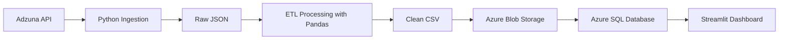

# South African Job Market Intelligence Platform

End-to-end Azure Data Engineering and Analytics project for South African job market data.

## Project Overview

This portfolio project addresses the need for reliable labour market intelligence in South Africa by ingesting job vacancy data from the Adzuna API. South African employers, recruiters, and labour market analysts need timely, accurate insights into hiring demand, salary expectations, and geographic distribution. The platform turns raw job listings into structured intelligence that supports actionable decision-making across hiring, workforce planning, and market research.

The data pipeline is built using Python and Pandas to orchestrate ingestion, transformation, and storage. Job listings are collected from the Adzuna API, saved as raw JSON for traceability, then processed through an ETL workflow that cleans records, removes duplicates, and handles missing values. Processed data is exported to a clean CSV file and uploaded to Azure Blob Storage before being loaded into an Azure SQL Database for analytics and dashboarding.

The Streamlit dashboard provides a recruiter-friendly analytics layer with interactive charts and filters powered by Plotly. Users can explore total jobs, average salary, top companies, job categories, and location trends. This end-to-end solution demonstrates modern Azure data engineering practices while making South African job market insights accessible and easy to interpret.

## Architecture



## 📸 Project Screenshots

The following screenshots demonstrate the end-to-end Azure Data Engineering pipeline and the resulting analytics dashboard for South African job market intelligence.

### 📊 Dashboard Overview


Interactive Streamlit dashboard displaying job market metrics, salary insights, categories, locations, and skill demand analytics.

### 🗄️ Azure SQL Database Results


Azure SQL Database storing processed job market data and supporting analytical queries.

### ☁️ Azure Blob Storage


Azure Blob Storage used to store processed job market datasets as part of the cloud data pipeline.

## Technologies Used

| Technology | Purpose |
|------------|---------|
| Python | Core scripting and ETL orchestration |
| Pandas | Data cleaning, transformation, and analysis |
| Requests | API ingestion from Adzuna |
| Azure Blob Storage | Raw and processed file storage |
| Azure SQL Database | Structured analytics storage |
| SQLAlchemy | Database connectivity and ORM support |
| pyodbc | SQL Server driver for Azure SQL Database |
| Streamlit | Interactive analytics dashboard |
| Plotly | Rich visualizations and charts |
| Git | Version control |
| GitHub | Repository management and collaboration |

## Features

- API ingestion
- Raw JSON storage
- ETL processing
- Duplicate removal
- Missing value handling
- Salary average calculation
- Azure Blob upload
- Azure SQL loading
- Interactive dashboard
- Filters and charts

## Folder Structure

```text
sa-job-market-intelligence/
    main.py
    README.md
    requirements.txt
    config/
    data/
        processed/
            cleaned_jobs.csv
        raw/
            adzuna_jobs_*.json
    docs/
    notebooks/
    src/
        dashboard/
            app.py
        database/
            sql_loader.py
        ingestion/
            adzuna_api.py
        processing/
            clean_jobs.py
        storage/
            blob_upload.py
        utils/
            config.py
    tests/
```

## How to Run

1. Create a virtual environment

```bash
python -m venv venv
```

2. Install requirements

```bash
pip install -r requirements.txt
```

3. Create a `.env` file

- Add the required environment variables with your own values.

4. Run the data ingestion and processing pipeline

```bash
python main.py
```

5. Run the dashboard

```bash
streamlit run src/dashboard/app.py
```

## Environment Variables

```text
ADZUNA_APP_ID=
ADZUNA_APP_KEY=
AZURE_STORAGE_CONNECTION_STRING=
AZURE_BLOB_CONTAINER_NAME=
SQL_SERVER=
SQL_DATABASE=
SQL_USERNAME=
SQL_PASSWORD=
```

## Dashboard Insights

The dashboard highlights key labour market metrics including total jobs, average salary, top companies, job categories, geographic locations, and salary distribution. These insights help stakeholders identify hiring hotspots, employer demand, skill gaps, and compensation benchmarks across the South African market.

## Current Limitations

- Currently pulls one API page with 20 jobs.

## Future Improvements

- Multi-page ingestion
- Skill extraction
- Azure Functions scheduling
- Daily refresh
- Deployment

## Author

Thubelihle Ntabela

Aspiring Data Engineer and Data Analyst

- GitHub: https://github.com/ThubelihleNtabela
- Email: thubelihlentabela@gmail.com
